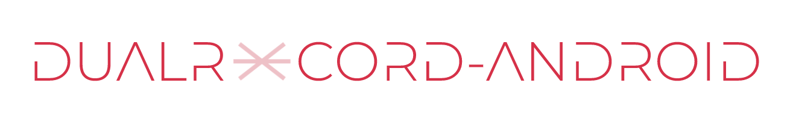

# DualRecord-Android  

DualRecord-Android is an Android library to utilize the multi-cameras on Android devices. It allows you to switch between any two cameras you like and sets up recorder SurfaceView for both the cameras. It also provides preview possibility for cameras where live preview is visible from both cameras. 

You can easily record videos from both cameras in high-definition.
There is a possibility of simultaneous recordings, but there is a camera lag due to the switching that takes place from one-camera to another.

Recently, Android provided the possibility of simultaneously capturing two cameras, but video recording is still not possible. Furthermore, that multicamera-capture works mostly on Pixel phones.

## Heart-of-DualRecord
The heart of this library is the dual camera setup on majority of latest Android devices.

